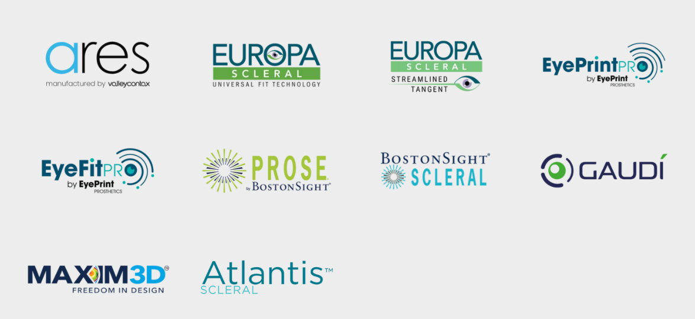
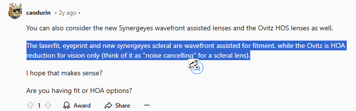

## 技术

- Laserfit、Boston Sight、Eye Print Pro等镜片制造商家。
  
  [G医生在Youtube访谈](https://www.youtube.com/watch?v=STzjBPlbvps&t=494s&ab_channel=TooPoshPodcast)

- **OVITZ Wave Scan**：OVITZ provides the world's first automated higher order aberration (HOA) correction system for life-changing vision improvements. 
  
  [Case Series: Impact of Wavefront-Guided Scleral Lenses on Visual Performance](files/HOA_CaseSeries_2020-20241118095502-qo7kb55.pdf)

## 书籍

- **《Ophthalmology: Current and Future Developments》**  
   作者：Melissa Barnett, Lynette K. Johns  
   出版社：Bentham Science Publishers (2017)  

- **《PENTACAM 角膜地形图：从入门到精通（原著第2版）》**  
   详细介绍 PENTACAM 角膜地形图的基本概念及应用。

- **《Wavefront Analysis, Aberrometers & Corneal Topography》**  
   深入探讨波前分析技术及其在角膜地形图中的应用。

- **《Optical Imaging and Aberrations, Part III: Wavefront Analysis》**  
   关注波前分析在光学成像中的重要性。

- **《Wavefront Optics for Vision Correction》**  
   介绍波前光学在视力矫正中的应用。

- **《Corneal Topography: A Guide for Clinical Application in Wavefront Era》**  
   为临床实践提供波前时代角膜地形图的应用指导。

- **《Wavefront Customized Visual Correction: The Quest for Super Vision II》**  
   探讨波前定制技术在视觉矫正中的最新进展。

- **《波前时代角膜地形图的临床应用（中文翻译版）》**  
   提供波前时代角膜地形图的应用实例与分析。

## Reddit讨论

- [您的 Laserfit 硬性透气镜片体验](https://www.reddit.com/r/Keratoconus/comments/15yxfq6/your_laserfit_scleral_lens_experience/)

- [Laserfit 与 Eye Print Pro 硬性透气镜片的比较](https://www.reddit.com/r/Keratoconus/comments/1350n0d/laserfit_vs_eyeprintpro_sclerals/)

 